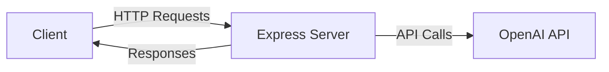

# EduLearnAI 

EduLearnAI is a full stack mini service designed to provide intelligent tutoring support for students, leveraging OpenAI's powerful language model to facilitate personalized learning experiences.

Live Web App: https://eduailearn.netlify.app 

## Features
- **Interactive Chat Interface**: Engage with students through a conversational interface that adapts to their learning needs.
- **Subject and Grade Level Customization**: Tailor responses based on the subject matter and the student's grade level.
- **Step-by-Step Explanations**: Provide clear and concise explanations of concepts to enhance understanding.
- **CORS Support**: Enable cross-origin requests for seamless integration with frontend applications.

## Architecture


## Tech Stack
- **Node.js**: JavaScript runtime for building the server.
- **Express**: Web framework for building the API.
- **CORS**: Middleware for enabling cross-origin resource sharing.
- **OpenAI**: API for accessing advanced language processing capabilities.
- **dotenv**: Module for managing environment variables.
- **React**: Ui framework.
- **TailWindCSS**: Css used for design

## Getting Started
To get started with the EduLearnAI backend, follow these steps:

1. **Clone the repository**:
   ```bash
   git clone https://github.com/petera-major/edu-backend.git
   cd edu-backend
   ```

2. **Install dependencies**:
   ```bash
   npm install
   ```

3. **Set up environment variables**:
   Create a `.env` file in the root directory and add your OpenAI API key:
   ```
   OPENAI_API_KEY=your_openai_api_key_here
   ```

4. **Start the server**:
   ```bash
   npm start
   ```

## Usage
Once the server is running, you can interact with the EduLearnAI backend by sending HTTP requests to the defined API endpoints. The server will respond with tutoring assistance based on the input provided.

## Roadmap
- [ ] Implement user authentication for personalized sessions.
- [ ] Expand the range of subjects and grade levels supported.
- [ ] Enhance the conversational capabilities of the AI tutor.
- [ ] Created a react frontend application to interact with the backend.
